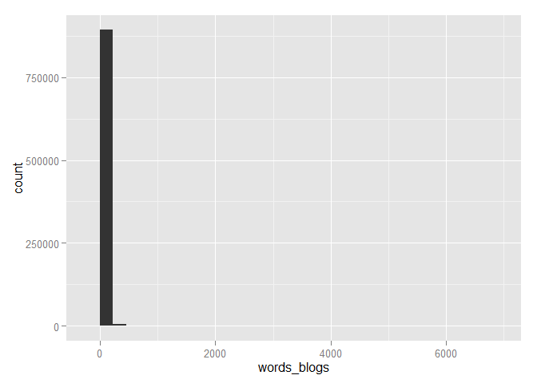
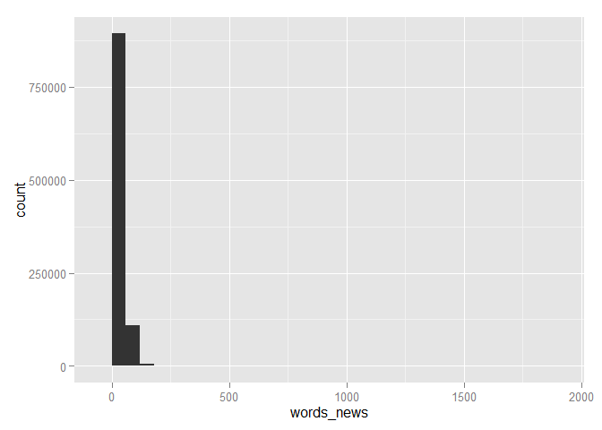
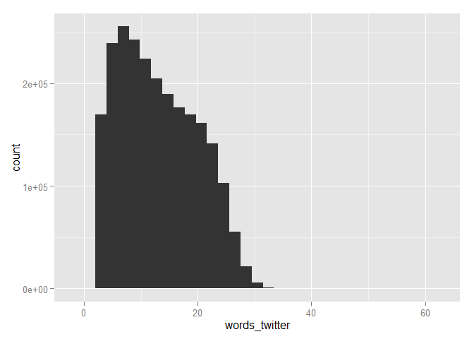

# Swiftkey Data Exploration
Bastiaan Quast  
Monday, November 10, 2014  

# Abstract
This report analyses some of the basic features of the Swiftkey data.


# Data
The dataset consist of ...

Full instructions for importing the data can be found in the [CodeBook](https://github.com/bquast/Data-Science-Capstone/blob/master/CodeBook.md) of the [GitHub repository](https://github.com/bquast/Data-Science-Capstone).

# Basic Statistics


```r
load("en_US.RData")
```


```r
length(blogs)
```

```
## [1] 899288
```

```r
length(news)
```

```
## [1] 1010242
```

```r
length(twitter)
```

```
## [1] 2360148
```


```r
library(stringi)
library(ggplot2)
```


```r
stri_stats_general( blogs )
```

```
##       Lines LinesNEmpty       Chars CharsNWhite 
##      899288      899288   208361438   171926076
```

```r
stri_stats_general( news )
```

```
##       Lines LinesNEmpty       Chars CharsNWhite 
##     1010242     1010242   203791405   170428853
```

```r
stri_stats_general( twitter )
```

```
##       Lines LinesNEmpty       Chars CharsNWhite 
##     2360148     2360148   162384825   134370864
```

# Textual Analysis
Count the words, give a summary and a distribution

```r
words_blogs   <- stri_count_words(blogs)
summary( words_blogs )
```

```
##    Min. 1st Qu.  Median    Mean 3rd Qu.    Max. 
##    0.00    9.00   29.00   42.43   61.00 6726.00
```

```r
qplot(   words_blogs )
```

```
## stat_bin: binwidth defaulted to range/30. Use 'binwidth = x' to adjust this.
```

 


```r
words_news    <- stri_count_words(news)
summary( words_news )
```

```
##    Min. 1st Qu.  Median    Mean 3rd Qu.    Max. 
##    1.00   19.00   32.00   34.66   46.00 1796.00
```

```r
qplot(   words_news )
```

```
## stat_bin: binwidth defaulted to range/30. Use 'binwidth = x' to adjust this.
```

 


```r
words_twitter <- stri_count_words(twitter)
summary( words_twitter )
```

```
##    Min. 1st Qu.  Median    Mean 3rd Qu.    Max. 
##     1.0     7.0    12.0    12.8    18.0    60.0
```

```r
qplot(   words_twitter )
```

```
## stat_bin: binwidth defaulted to range/30. Use 'binwidth = x' to adjust this.
```

 
